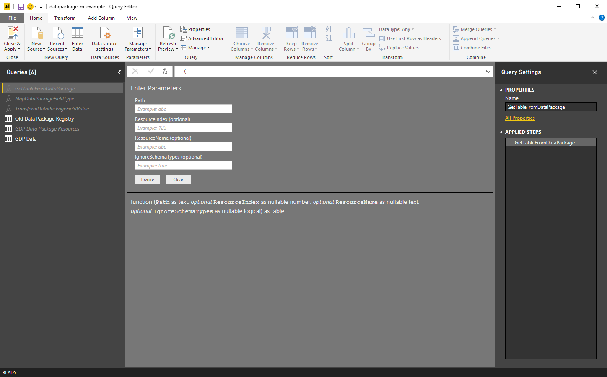
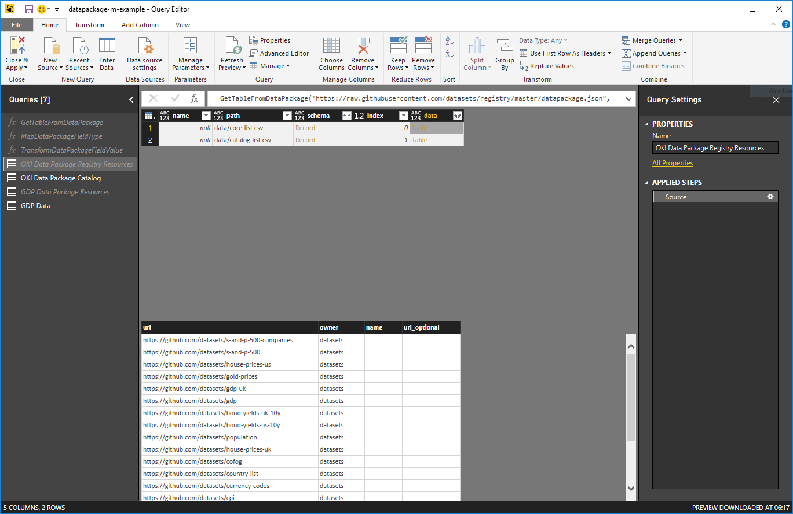
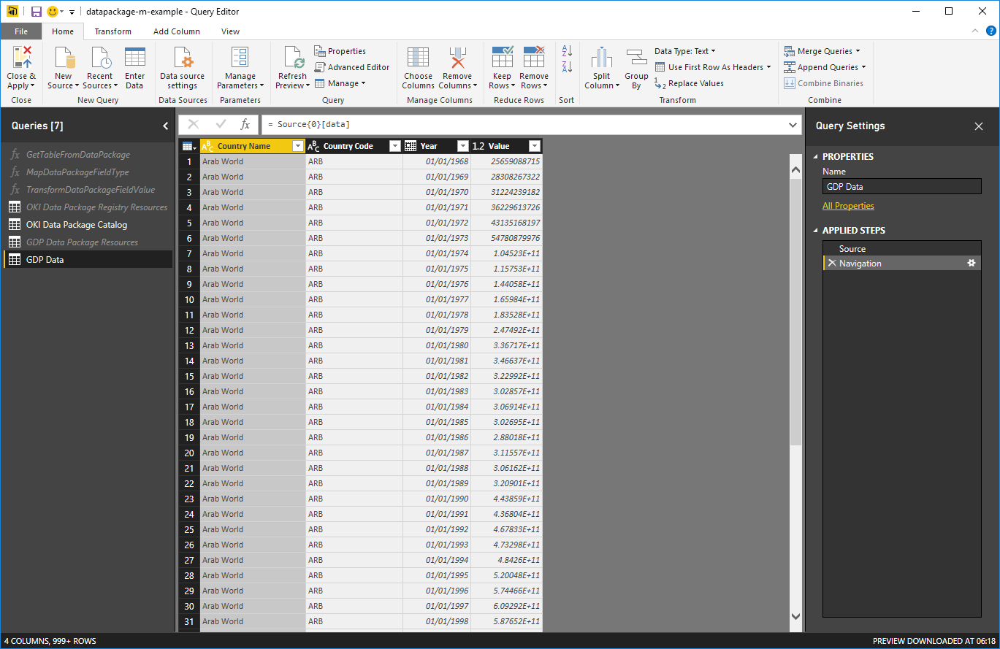
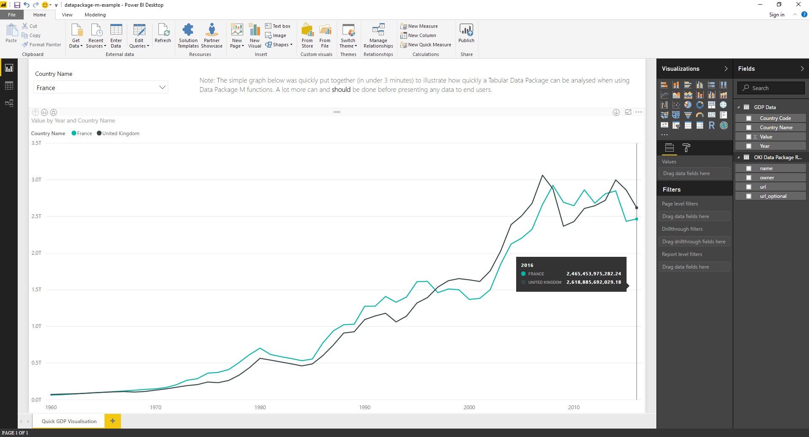

# Tabular Data Package functions for Power BI and Power Query

A set of functions written in [M](https://msdn.microsoft.com/en-us/library/mt211003.aspx?f=255&MSPPError=-2147217396) for working with [Tabular Data Packages](http://specs.frictionlessdata.io/tabular-data-package/) in Power BI Desktop and Power Query (also known as 'Get & Transform') in Excel.

The functions were written to reduce the time and effort required to convert Tabular Data Package resources into Power BI or Power Query (Excel 2010 onwards) tables with correctly typed columns. The main function, `GetTableFromDataPackage`, can extract tables from either remote or local Data Packages and dynamically apply the [JSON Table Schema](http://specs.frictionlessdata.io/json-table-schema/) metadata (i.e. field names and field types) when creating a table. It also allows you to enumerate a Data Package's resources and quickly peek at or click through to the typed data.

  
*Invoking the `GetTableFromDataPackage` function*

  
*Viewing the resources for a Data Package and previewing the resource data*  

  
*Pulling the data from a GDP Data Package resource after navigating from the resource list*

  
*Creating a quick visualisation of the GDP data*

## JSON Table Schema field types to M types

Collectively, the functions implicitly handle the field type conversions for the most common [JSON Table Schema](http://specs.frictionlessdata.io/json-table-schema/) field types:
* string -> text
* number -> number
* integer -> number
* boolean -> logical
* date -> date
* datetime -> datetime
* time -> time

All other JSON Table Schema field types are given the M type of 'any'. There is an option to ignore the JSON Table Schema for scenarios when implicit type conversion causes errors.

## Setup

### Option 1: Power BI Desktop template

1. Download the [datapackage-m-template.pbit](./templates/datapackage-m-template.pbit) file and open it with Power BI Desktop.
2. Open the Query Editor window and invoke the `GetTableFromDataPackage` function by supplying a local/remote Data Package path and either a resource name or index. 

Note: You can invoke `GetTableFromDataPackage` with just the Data Package path to get a table containing the list of resources that can be navigated through.

For instructions on how to open the Query Editor window in Power BI Desktop [click here](https://powerbi.microsoft.com/en-us/documentation/powerbi-desktop-query-overview/).

### Option 2: Excel template

1. Download the [datapackage-m-template.xltx](./templates/datapackage-m-template.xltx) file and open it with Excel 2010 or later. For Excel 2010 and 2013, you MUST have the [Power Query](https://www.microsoft.com/en-gb/download/details.aspx?id=39379) add-in installed (installing the latest version is recommended).
2. Open the Query Editor window and invoke the `GetTableFromDataPackage` function by supplying a local/remote Data Package path and either a resource name or index.

Note: You can invoke `GetTableFromDataPackage` with just the Data Package path to get a table containing the list of resources that can be navigated through.

For instructions on how to open the Query Editor window in Excel [click here](https://support.office.com/en-gb/article/Introduction-to-the-Query-Editor-Power-Query-1d6cdb63-bf70-4ae8-a7d5-6ae9547004d9).

### Option 3: Create a new function with the M code

1. Download [GetTableFromDataPackage.pq](./functions/GetTableFromDataPackage.pq). Also download the two helper functions: [MapDataPackageFieldType.pq](./functions/MapDataPackageFieldType.pq) and [TransformDataPackageFieldValue.pq](./functions/TransformDataPackageFieldValue.pq).
2. For each function, create a blank query, paste the M code into the Advanced Editor, click 'Done', and give the function the same name as its .pq file (e.g. for 'GetTableFromDataPackage.pq' this would be 'GetTableFromDataPackage').
 
You're now ready to invoke the functions through the standard function invocation UI or via M code as shown in the examples below.


## Examples

You can invoke the `GetTableFromDataPackage` function through the Power BI Desktop or Power Query user interface (UI). Download an example file to see it in action:
* Power BI Desktop example file - [datapackage-m-example.pbix](./examples/datapackage-m-example.pbix)
* Excel workbook example file - [datapackage-m-example.xlsx](./examples/datapackage-m-example.xlsx)

This section focuses on how to invoke the `GetTableFromDataPackage` function directly through M code in the Advanced Editor.

### Getting the list of resources from a Data Package (remote)

```text
let
    Source = GetTableFromDataPackage("https://raw.githubusercontent.com/datasets/gdp/master/datapackage.json")
in
    Source
```

### Getting the list of resources from a Data Package (local)

```text
let
    Source = GetTableFromDataPackage("C:\gdp\datapackage.json")
in
    Source
```

### Getting the data for a resource based on the zero-based index (remote)

```text
let
    Source = GetTableFromDataPackage("https://raw.githubusercontent.com/datasets/gdp/master/datapackage.json", 0)
in
    Source
```

### Getting the data for a resource based on the zero-based index (local)

```text
let
    Source = GetTableFromDataPackage("C:\gdp\datapackage.json", 0)
in
    Source
```

### Getting the data for a resource based on its name (remote)

```text
let
    Source = GetTableFromDataPackage("https://raw.githubusercontent.com/datasets/gdp/master/datapackage.json", null, "gdp")
in
    Source
```

### Getting the data for a resource based on its name (local)

```text
let
    Source = GetTableFromDataPackage("C:\gdp\datapackage.json", null, "gdp")
in
    Source
```

### Ignoring the JSON Table Schema field types to get around field type conversion errors

```text
let
    Source = GetTableFromDataPackage("https://raw.githubusercontent.com/datasets/gdp/master/datapackage.json", null, "gdp", true)
in
    Source
```

## Licensing

This work was created by [Nimble Learn](http://www.nimblelearn.com) and has been published with the MIT License. The full license can be viewed in [plain text](./LICENSE.txt).

## Notes

* When prompted for the 'Privacy Level' by Power BI or Power Query, choose either 'Public' or 'Organizational'.

* You may want to try some of the [Core Datasets (Data Packages)](https://github.com/datasets) maintained by [Open Knowledge International (OKI)](http://www.okfn.org).

* When working with remote Data Packages located in GitHub, ensure that you are using the URL for the raw file e.g. [https://raw.githubusercontent.com/datasets/gdp/master/datapackage.json](https://raw.githubusercontent.com/datasets/gdp/master/datapackage.json) instead of [https://github.com/datasets/gdp/blob/master/datapackage.json](https://github.com/datasets/gdp/blob/master/datapackage.json) where the latter will give an error.

* The functions can be adapted to work with the modern 'Get Data' experience in SQL Server 2017 but this scenario is untested.

## Known issues

* If the field values in a CSV file do not match the expected field type, as defined in the [JSON Table Schema](http://specs.frictionlessdata.io/json-table-schema/), the invalid values in the column will return an error (Expression.Error). You can get around this by setting the ignore_schema_types parameter to 'true'.