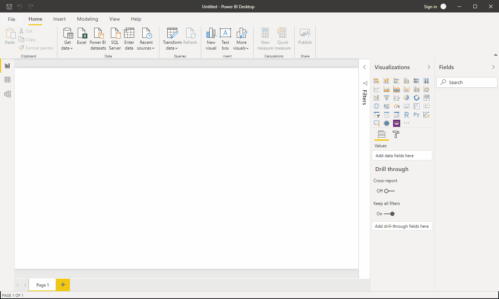
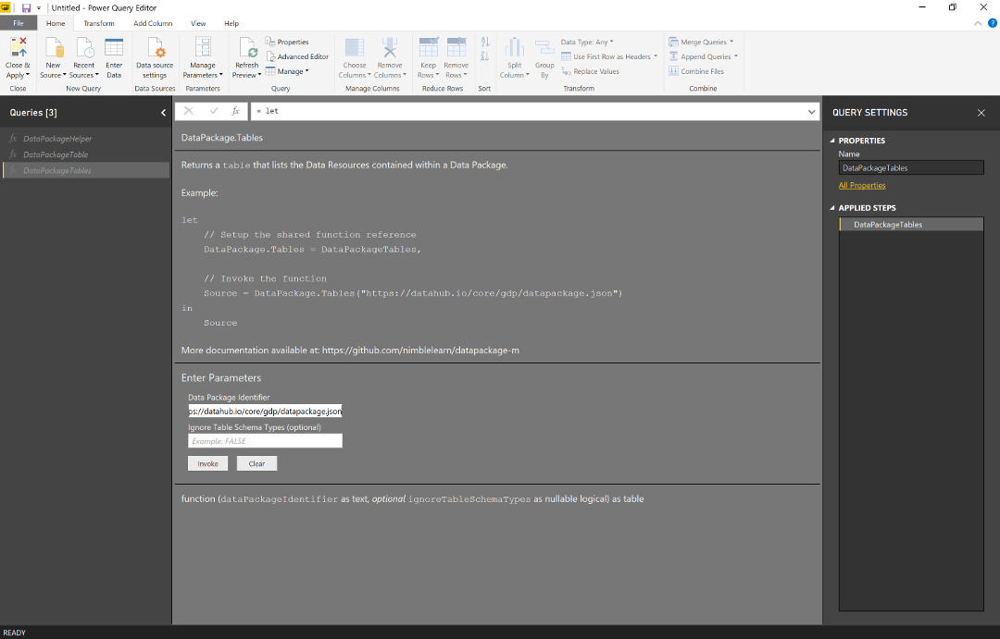
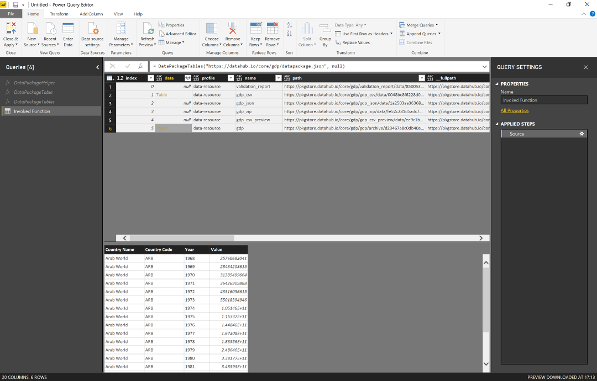
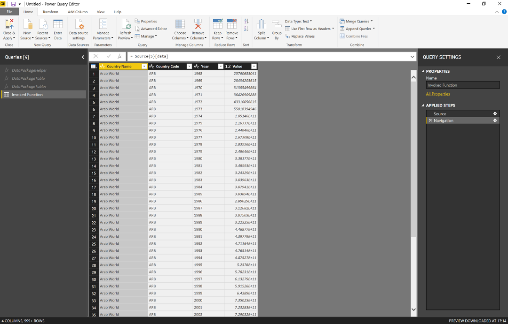
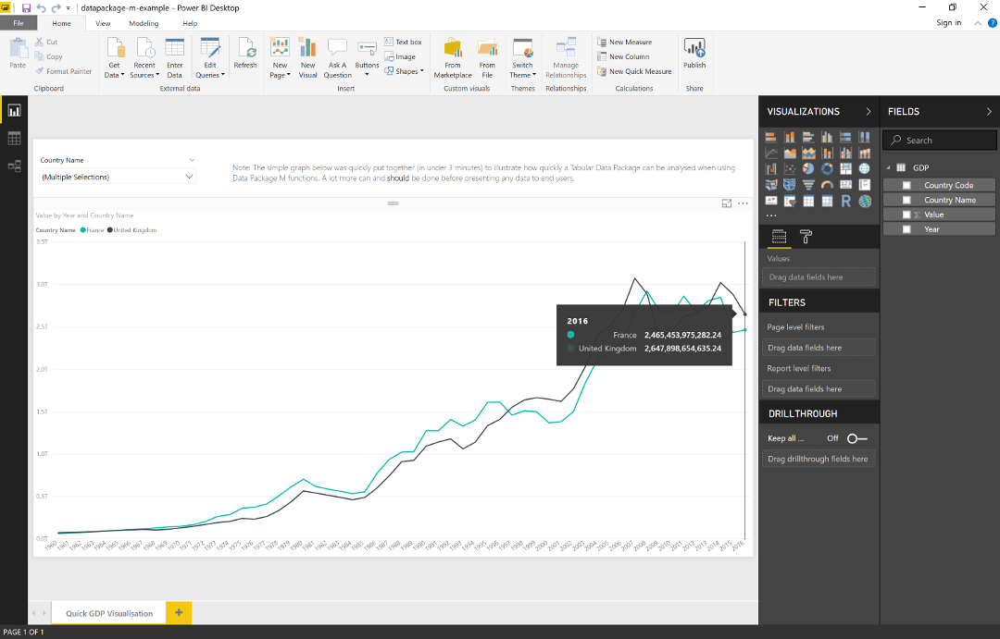
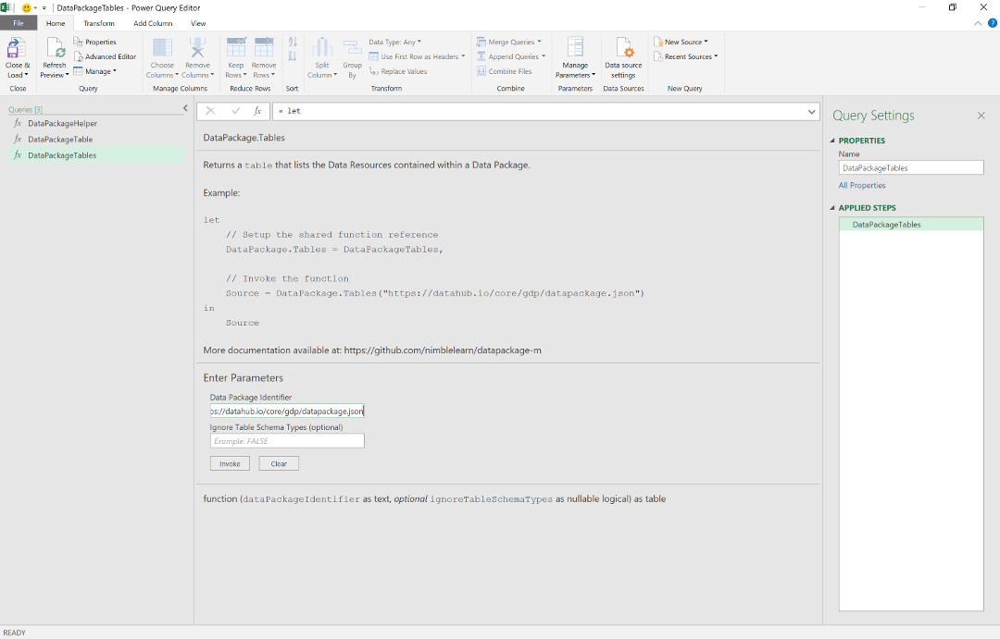
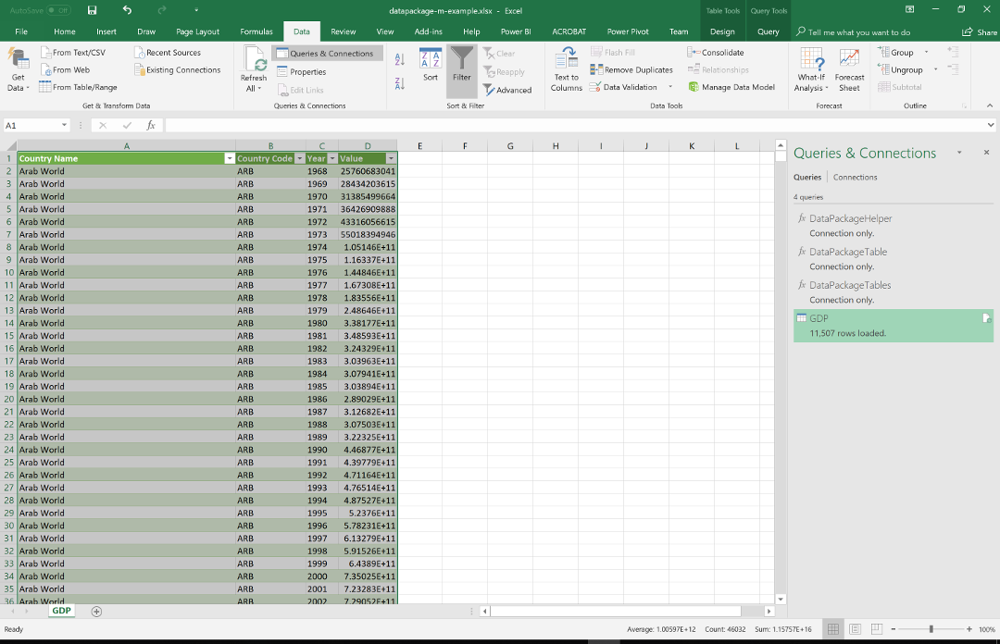

# Data Package M (datapackage-m)

A set of functions written in [Power Query M](https://msdn.microsoft.com/en-us/library/mt211003.aspx?f=255&MSPPError=-2147217396) for working with [Tabular Data Packages](http://frictionlessdata.io/docs/tabular-data-package/) in [Power BI Desktop](https://powerbi.microsoft.com/en-us/desktop/) and [Power Query for Excel](https://support.office.com/en-us/article/introduction-to-microsoft-power-query-for-excel-6e92e2f4-2079-4e1f-bad5-89f6269cd605) (also known as 'Get & Transform' in Excel 2016 and later). Data Package M functions implement several Frictionless Data [specifications](https://frictionlessdata.io/specs/) that help you to go from data to insight, *faster*.


## What is Frictionless Data?


A Tabular Data Package is a simple format for publishing and sharing tabular data. Tabular Data Packages extend and specialise the Data Package specification, and both come under the umbrella of [Frictionless Data](https://frictionlessdata.io/).

Below is the vision statement taken from the Frictionless Data website:

>Frictionless Data shortens the path from data to insight with a collection of [specifications](https://frictionlessdata.io/specs/) and [software](https://frictionlessdata.io/software/) for the publication, transport, and consumption of data. At the heart of our approach is a deep understanding of the multi-faceted nature of data work, and an emphasis on platform-agnostic interoperability. From consumer spreadsheet software, through to cloud-based services for data analysis, the future of data is frictionless.

Visit [https://frictionlessdata.io](https://frictionlessdata.io) to learn more.


## Data Package M in Power BI



  
*Invoking the `DataPackage.Tables` function*

  
*Viewing the resources for a GDP Tabular Data Package and previewing the resource data*  

  
*Getting a table from a GDP Tabular Data Package resource after navigating from the resource list*

  
*Creating a quick visualisation of the GDP data*

## Data Package M in Power Query for Excel


  
*Invoking the `DataPackage.Tables` function*

  
*Viewing the resources for a GDP Tabular Data Package and previewing the resource data*  

  
*Getting a table from a GDP Tabular Data Package resource after navigating from the resource list*

  
*The GDP table is loaded to a new Excel Worksheet and/or [Data Model](https://support.office.com/en-us/article/create-a-data-model-in-excel-87e7a54c-87dc-488e-9410-5c75dbcb0f7b) and ready for analysis*

## Data Package M Functions

| Function Name      | Query/Shared Name*       | Description                                                                 |
| :----------------- | :---------------- | :-------------------------------------------------------------------------- |
| DataPackage.Table  | DataPackageTable  | Returns a [Tabular Data Resource](https://frictionlessdata.io/specs/tabular-data-resource/) as a `table` |
| DataPackage.Tables | DataPackageTables | Returns a `table` that lists the [Data Resources](https://frictionlessdata.io/specs/data-resource/) contained within a Data Package |
| DataPackage.Helper | DataPackageHelper | Returns a Data Package helper function as a `function`                      |

*This is the name that appears in the Power Query Editor in the 'Queries' pane. When invoking the functions through the Power Query Editor's 'Invoke Function' dialog, this name will appear in the auto-generated Power Query M expressions. This is also the name that will be exposed to the shared function library when the functions have been [setup](#setup).


### DataPackage.Table

| Parameter              | Type         | Description                                              |
| :--------------------- | :----------- | :------------------------------------------------------- |
| dataPackageIdentifier  | text         | A valid [Data Package Identifier](https://frictionlessdata.io/specs/data-package-identifier/) |
| dataResourceIndex      | number       | A valid Data Resource index                              |
| dataResourceName       | text         | A valid Data Resource name                               |
| ignoreTableSchemaTypes | logical      | Controls whether the Table Schema is applied to the data |


### DataPackage.Tables

| Parameter              | Type         | Description                                              |
| :--------------------- | :----------- | :------------------------------------------------------- |
| dataPackageIdentifier  | text         | A valid [Data Package Identifier](https://frictionlessdata.io/specs/data-package-identifier/) |
| ignoreTableSchemaTypes | logical      | Controls whether the [Table Schema](https://frictionlessdata.io/specs/table-schema/) is applied to the data |

Any Data Resource that is detected as being tabular will contain the data table in the 'data' column. Data Package properties that are inferred and added by Data Package M have their name preceded by double underscore e.g. '__fullpath'.


### DataPackage.Helper

| Parameter              | Type         | Description                                              |
| :--------------------- | :----------- | :------------------------------------------------------- |
| functionName           | text         | A valid Data Package helper function name                |

This is a special function that acts as a library of Data Package helper functions. As the returned functions are only used as helpers for the `DataPackage.Table` and `DataPackage.Tables` functions, please see the comments inline with the Power Query M expressions to understand how they work. Advanced Power Query M users may wish to use these helper functions to work with Data Package metadata more directly.


## Table Schema Type Conversions

Type conversion is attempted for the most common [Table Schema](https://frictionlessdata.io/specs/table-schema/) types:

| Table Schema Type | M Type   |
| :-----------------| :------- |
| string            | text     |
| number            | number   |
| integer           | number   |
| boolean           | logical  |
| date              | date     |
| datetime          | datetime |
| time              | time     |

Unhandled types are defaulted to the `text` type. Setting the `ignoreTableSchemaTypes` property to `true` when invoking `DataPackage.Table` or `DataPackage.Tables` will stop the Table Schema from being applied. This can be useful when one or more values in a column cause an error when the Table Schema type conversions are attempted.


## Implemented Frictionless Data Specifications

The Data Package M functions are aligned closely with the v1 Frictionless Data specifications. The below table maps the significant Data Package M features to the corresponding specification(s):

| Feature                                      | Specification                                        | Notes                                   |
| :------------------------------------------- | :--------------------------------------------------- | :-------------------------------------- |
| Data Package Identifier resolution           | [Data Package Identifier](https://frictionlessdata.io/specs/data-package-identifier/) | Identifier Strings only |
| Remote and local resource path handling      | [Data Resource](https://frictionlessdata.io/specs/data-resource/), [Tabular Data Resource](https://frictionlessdata.io/specs/tabular-data-resource/) | Includes handling path arrays (i.e. data in multiple files)  |
| Tabular Data Resource metadata handling      | [Tabular Data Resource](https://frictionlessdata.io/specs/tabular-data-resource/) | 'dialect' is partially handled. 'encoding' is handled for the most common encoding types**|
| Table Schema type conversions                | [Table Schema](https://frictionlessdata.io/specs/table-schema/), [Tabular Data Resource](https://frictionlessdata.io/specs/tabular-data-resource/) | [Partial support](#table-schema-type-conversions). Includes resolving and applying remote schemas. |
| Inline data handling                         | [Tabular Data Resource](https://frictionlessdata.io/specs/tabular-data-resource/) | |
| Compressed resource handling                 | [Compression Resources Pattern (WIP)](https://github.com/frictionlessdata/specs/issues/290) | Gzip compression support only    |

**The currently handled encoding types are gb2312, x-cp20949, euc-jp, iso-8859-1, iso-8859-2, iso-8859-3, iso-8859-4, iso-8859-5, iso-8859-6, iso-8859-7, iso-8859-8, iso-8859-9, iso-8859-13, iso-8859-15, us-ascii, utf-32be, utf-32, utf-16, utf-8, utf-7, and windows-1252.

## Setup

### Option 1: Power BI Desktop Template

1. Download the [latest release](https://github.com/nimblelearn/datapackage-m/releases).
2. Open the 'datapackage-m-template.pbit' file found in the 'templates' folder with Power BI Desktop.
3. Open the Power Query Editor window and invoke the `DataPackageTable` or `DataPackageTables` function with a valid [Data Package Identifier String](https://frictionlessdata.io/specs/data-package-identifier/). Invoking the `DataPackageTable` function also requires a valid resource name or index.

For instructions on how to open the Power Query Editor window in Power BI Desktop [click here](https://powerbi.microsoft.com/en-us/documentation/powerbi-desktop-query-overview/).

### Option 2: Excel Template

1. Download the [latest release](https://github.com/nimblelearn/datapackage-m/releases).
2. Open the 'datapackage-m-template.xltx' file found in the 'templates' folder with Excel 2010 or later. For Excel 2010 and 2013, you MUST have the [Power Query for Excel](https://www.microsoft.com/en-gb/download/details.aspx?id=39379) add-in installed (installing the latest version is recommended). Power Query is built-in from with Excel 2016 and later, and can be found under the 'Data' tab in the 'Get & Transform Data' section.
3. Open the Power Query Editor window and invoke the `DataPackageTable` or `DataPackageTables` function with a valid [Data Package Identifier String](https://frictionlessdata.io/specs/data-package-identifier/). Invoking the `DataPackageTable` function also requires a valid resource name or index.

For instructions on how to open the Power Query Editor window in Excel [click here](https://support.office.com/en-gb/article/Introduction-to-the-Query-Editor-Power-Query-1d6cdb63-bf70-4ae8-a7d5-6ae9547004d9).

### Option 3: Create New Functions from the Power Query M Files

This scenario is mostly applicable if you have an existing Power BI or Excel file, or if you're an advanced Power Query M user.

1. Download the [latest release](https://github.com/nimblelearn/datapackage-m/releases).
2. For each .pq file in the 'functions' folder, create a blank query, copy and paste the Power Query M expression into the Advanced Editor, click 'Done', and give the function the same name as its .pq file but without the dot (.) or extension (e.g. for [DataPackage.Table.pq](./functions/DataPackage.Table.pq) the name should be 'DataPackageTable').

You're now ready to invoke the Data Package M functions through the Power Query 'Invoke Function' dialog or via Power Query M expressions as shown in the examples below.


## Examples


### Example Files

You can invoke the `DataPackage.Table` and `DataPackage.Tables` functions through the Power BI Desktop or Power Query for Excel user interface (UI) using the 'Invoke Function' dialog.

 Download the [latest release](https://github.com/nimblelearn/datapackage-m/releases) and try one of the example files found in the 'examples' folder.

| Example File               | Description                                                                                  |
| :------------------------- | :------------------------------------------------------------------------------------------- |
| datapackage-m-example.pbix | A simple Power BI Desktop example based on a [GDP](https://datahub.io/core/gdp) Data Package |
| datapackage-m-example.xlsx | A simple Excel Workbook example based on a [GDP](https://datahub.io/core/gdp) Data Package   |


### Power Query M Expression Examples

The following examples show the *recommended* way to invoke the Data Package M functions when using them in your Power Query M expressions.

#### Getting the List of Resources from a Data Package (Remote)

```text
let
    // Setup the shared function reference
    DataPackage.Tables = DataPackageTables,

    // Invoke the function
    Source = DataPackage.Tables("https://datahub.io/core/gdp/datapackage.json")
in
    Source
```

#### Getting the List of Resources from a Data Package (Local)

```text
let
    // Setup the shared function reference
    DataPackage.Tables = DataPackageTables,

    // Invoke the function
    Source = DataPackage.Tables("C:\gdp\datapackage.json")
in
    Source
```

#### Getting the Data for a Resource Using Its Index (Remote)

```text
let
    // Setup the shared function reference
    DataPackage.Table = DataPackageTable,

    // Invoke the function
    Source = DataPackage.Table("https://datahub.io/core/gdp/datapackage.json", 0)
in
    Source
```

#### Getting the Data for a Resource Using Its Index (Local)

```text
let
    // Setup the shared function reference
    DataPackage.Table = DataPackageTable,

    // Invoke the function
    Source = DataPackage.Table("C:\gdp\datapackage.json", 0)
in
    Source
```

#### Getting the Data for a Resource Using Its Name (Remote)

```text
let
    // Setup the shared function reference
    DataPackage.Table = DataPackageTable,

    // Invoke the function
    Source = DataPackage.Table("https://datahub.io/core/gdp/datapackage.json", null, "gdp")
in
    Source
```

#### Getting the Data for a Resource Using Its Name (Local)

```text
let
    // Setup the shared function reference
    DataPackage.Table = DataPackageTable,

    // Invoke the function
    Source = DataPackage.Table("C:\gdp\datapackage.json", null, "gdp")
in
    Source
```

#### Getting the Data for a Resource Without Table Schema Type Conversion

```text
let
    // Setup the shared function reference
    DataPackage.Table = DataPackageTable,

    // Invoke the function
    Source = DataPackage.Table("https://datahub.io/core/gdp/datapackage.json", null, "gdp", true)
in
    Source
```

#### Invoking a Data Package Helper Function Directly

```text
let
    // Setup the shared function reference
    DataPackage.Helper = DataPackageHelper,

    // Get the required helper function by name
    DataPackage.Package = DataPackage.Helper("DataPackage.Package"),

    // Invoke the helper function
    Source = DataPackage.Package("https://datahub.io/core/gdp/datapackage.json")
 in
    Source
```

## Try Data Package M with the Core Datasets

* [Core Datasets on DataHub](https://datahub.io/core/)
* [Core Datasets on GitHub](https://github.com/datasets/)


## Licensing

This work was created by [Nimble Learn](http://www.nimblelearn.com) and has been published with the MIT License. The full license can be viewed in [plain text](./LICENSE.txt).


## Notes

* When prompted for the 'Privacy Level' by Power BI or Power Query for Excel, choose either 'Public' or 'Organizational'.

* If the field values in a CSV file do not match the expected field type, as defined in the [Table Schema](https://frictionlessdata.io/specs/table-schema/), the invalid values in the column will return an error (Expression.Error). You can get around this by setting the `ignoreTableSchemaTypes` parameter to `true`.


## Known Issues

### Power BI Service Data Refresh Support

Data refresh currently works from Power BI Desktop and Power Query for Excel but not from the Power BI service. The Power BI service performs a static analysis on all the Power Query M expressions in a Power BI file to determine whether it can be refreshed by the service. One scenario where a data refresh is not supported is when the [Web.Contents](https://msdn.microsoft.com/en-us/query-bi/m/web-contents?f=255&MSPPError=-2147217396) function is used with a [dynamically generated URL](https://ideas.powerbi.com/forums/265200-power-bi-ideas/suggestions/10927416-web-contents-should-support-scheduled-refresh-ev). This is one of the functions that Data Package M uses to dynamically handle Data Packages and this currently prevents the Power BI Service from being able to refresh the data.

If you require Power BI service data refresh support, you can try the [Data Package Connector](https://github.com/nimblelearn/datapackage-connector). This is a [Power BI Custom Connector](https://docs.microsoft.com/en-us/power-bi/desktop-connector-extensibility) that's based on the same Data Package M functions and supports data refresh in the Power BI service through a [Power BI Data Gateway](https://docs.microsoft.com/en-us/power-bi/service-gateway-onprem).